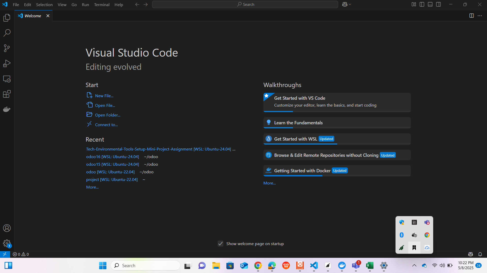
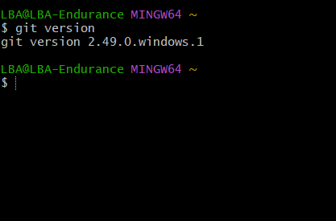
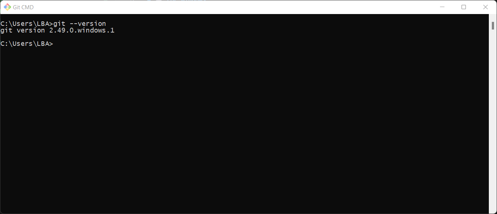

# Tech-Environmental-Tools-Setup-Mini-Project-Assignment
## Enviromental setup 
# 1. virtual studio code
# 🧩Step-by-Step: Install VS Code
1. Download VS Code
  - I Go to the official website: https://code.visualstudio.com

2. Click the Download button for your operating system (Windows, macOS, or Linux).

  - Run the Installer
3. After downloading, open the installer file:
   - On Windows: it’s a .exe file.

4. i Follow Installation Instructions for Windows:
  - Check the box “Add to PATH” and “Open with Code” (optional but helpful).

5. Click Next and then Install.

6. Open VS Code
   - After installation, launch VS Code:
   - Double-click the icon or search for "Visual Studio Code" in my system’s search bar.

7. Install Extensions (Optional)
Click the Extensions icon (square icon on the sidebar).

#virtual studio code enviroment!

# 2. GIT INSTALLATION

# 💻 For Windows
 - Download Git
 <https://git-scm.com/download/win>

### After the Download has finish

  - Run the Installer
     - by Double-click the .exe file.

       - Click through the setup. 

  - Click Finish to complete installation.

    - Verify Installation
       - Open Command Prompt or Git Bash and run:
       - git --version

# GIT SCREENSHOT

1. Screenshot 1
   
   

2. Screenshot 2

 

3. Screenshot 3
   